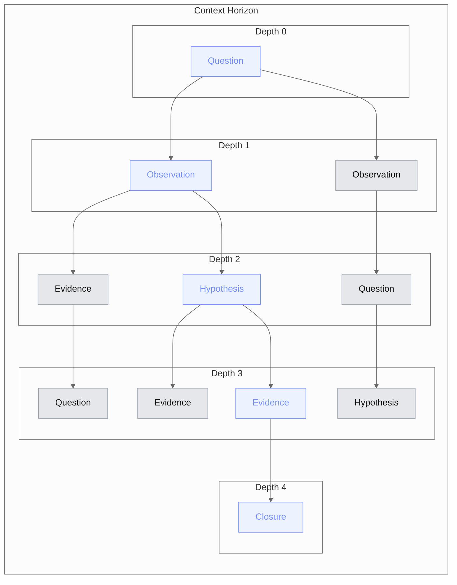
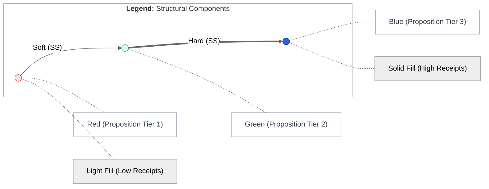
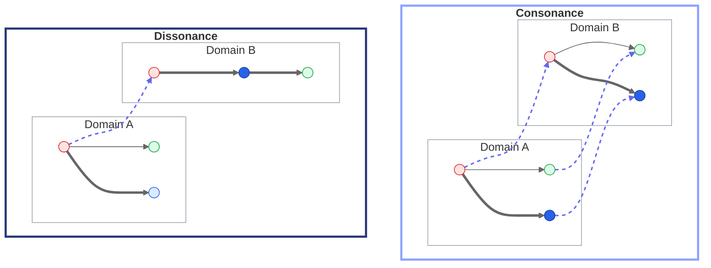
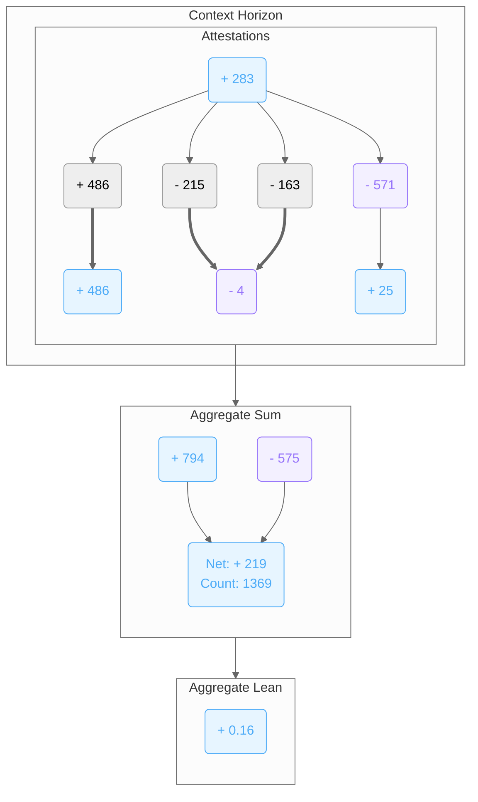
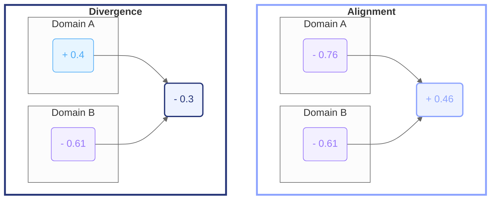
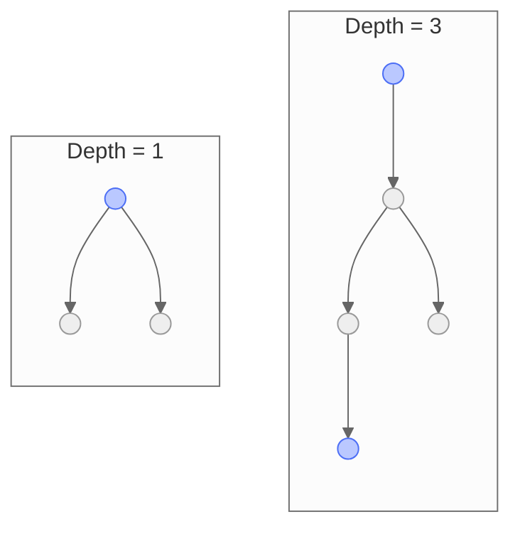
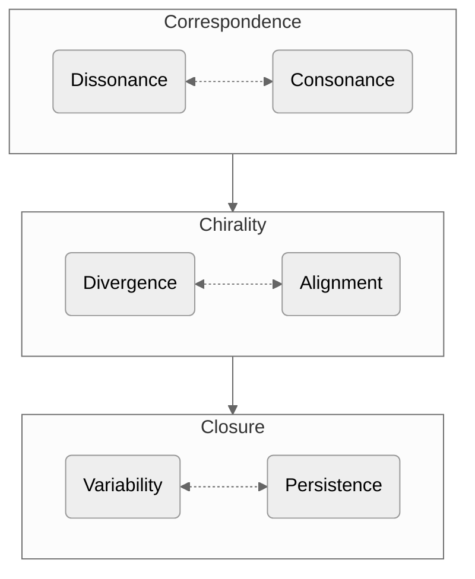

import { Center, rem, Grid, GridCol } from "@mantine/core";
import {
  IconHexagon,
  IconUserHexagon,
  IconScale,
  IconWhirl,
  IconCircle,
  IconBulb,
  IconBulbFilled,
  IconStack2Filled,
  IconTool,
  IconRotate2,
  IconRotateClockwise2,
  IconReceipt,
} from "@tabler/icons-react";
import ConceptFeatures from "../../components/Commons/ConceptFeatures/ConceptFeatures";
import ContextWindowBars from "../../components/Commons/ContextWindowBars/ContextWindowBars";
import ClassificationRegisters from "../../components/Commons/ClassificationRegisters/ClassificationRegisters";
import AttestationInput from "../../components/Commons/AttestationInput/AttestationInput";
import PropositionCard from "../../components/Commons/PropositionCard/PropositionCard";
import ContextWindowExample from "../../components/Commons/ContextWindowExample/ContextWindowExample";

# Overview

## What this is

**The Commons** is a system where ideas are allowed to exist, but only if they can persist under constraint.

Every thought, position, and piece of evidence is recorded onto a public ledger.
Nothing exists without lineage. If something appears, it has a trace. If it persists, it has support.

Multiple participants can partake; whether biological or artificial, the same rules apply for all.

## The Concept

- [Charge](/commons#charge) is provided by the system, as a shared and conserved resource.
- [Participants](/commons#participant) can allocate or reclaim Charge by contributing:
  - [Propositions](/commons#proposition) - Thoughts, ideas, questions, hypotheses, claims.
  - [Attestations](/commons#attestation) - A directional stance; Supporting or Refuting Propositions.
  - [Supersessions](/commons#supersession) - Propositions supercede one another through various branching types;
    Revise, Reclassify, Variant, Reconcile, and Commit.
  - [Receipts](/commons#receipt) - Confirmation and verifiable metadata from utilising
    system-defined [Instruments](/commons#instruments).

<ConceptFeatures />

- Propositions are recorded into [Classification Registers](/commons#classification-registers),
  which represent structured containers of context.
- Participant's navigate through [Cycles & Phases](/commons#cycles-and-phases),
  determining which Classification Registers can be read, superceded from, and written to.
- [Observables](/commons#observables) are computed properties calculated by comparing unique aspects
  of the inputs between two complementary [Domains](/commons#domain);
  - Registerial-Supersessional shape & structure -> [Correspondence](/commons#correspondence)
  - Attestational direction & magnitude -> [Chirality](/commons#chirality)
  - Committal depth & frequency -> [Closure](/commons#closure)
- [Tension](/commons#tension) becomes a dynamic system output, computed by symmetrically balancing the Observables.
- Whether a contribution allocates or reclaims Charge depends on how it affects Tension.

Multiple Participants from a variety of sources is desired. Whether synthetic or human,
each may provide a unique [Perspective](/commons#perspective) over the changing context space,

```mermaid
---
config:
  flowchart:
    curve: basis
  theme: neutral
---
flowchart TB
    PARTICIPANT(Participant)

    subgraph SUBSTRATE["Relational Substrate"]
        direction TB

        P(Propositions)
        SS(Supersessions)
        A(Attestations)
        R(Commits)

        P --> SS
        SS -.-> P
        P --> A
        P --> R
    end

    PARTICIPANT -->|"Input"| SUBSTRATE

    subgraph OBS["Observable System"]
        direction TB

        subgraph MEAS["Measurements"]
            direction LR
            C(Correspondence)
            H(Chirality)
            L(Closure)
        end

        subgraph DERIVED["Derived"]
            direction TB

            subgraph PROJ["Projection"]
                direction LR
                TU(Turbulence)
                PR(Prominence)
            end

            subgraph FIELD["Field"]
                direction LR
                T(Tension)
            end
        end

        C ==>|"(-)"| TU
        C ==>|"(+)"| PR

        H ==>|"(-)"| TU
        H ==>|"(+)"| PR

        L ==>|"(-)"| TU
        L ==>|"(+)"| PR

        TU ==> T
        PR ==> T
    end

    SS --> C
    A --> H
    R --> L

    subgraph REGISTERS["Classification Registers"]
        direction TB

        TR("↑ Tension <small>(Potential Charge)</small>")

        subgraph DOMAIN["Active Domain"]
            direction LR

            subgraph EMERGENCE["Emergence"]
                direction TB

                PROMINENT(↑ Prominence)
                ACTIVITY(Activity):::activityRegister
                FRONTIER(Frontier):::frontierRegister
                CANON(Canon):::canonRegister
            end

            subgraph SETTLEMENT["Settlement"]
                direction TB

                TURBULENT(↑ Turbulence)
                SIGNAL(Signal):::signalRegister
                STANCE(Stance):::stanceRegister
                CONCORD(Concord):::concordRegister
            end
        end
    end

    T --> REGISTERS

    TR -.->|"T<small>dir</small> < 0"| TURBULENT
    TR -.->|"T<small>dir</small> > 0"| PROMINENT

    PROMINENT -.->|"P1"| ACTIVITY
    ACTIVITY -.->|"P2, P5"| FRONTIER
    FRONTIER -.->|"P3, P6"| CANON
    CANON -.->|"P4"| ACTIVITY
    CANON -.->|"P7"| PROMINENT

    TURBULENT -.->|"P1"| SIGNAL
    SIGNAL -.->|"P2, P5"| STANCE
    STANCE -.->|"P3, P6"| CONCORD
    CONCORD -.->|"P4"| SIGNAL
    CONCORD -.->|"P7"| TURBULENT

    CH(Context Horizon)
    PERS(Perspective)

    CH ---> PERS
    PERS -.->|"← Tension"| CH

    PARTICIPANT_OUT(Participant)

    REGISTERS --> CH

    PERS -->|"Output"| PARTICIPANT_OUT

    classDef activityRegister fill:#fee2e2,stroke:#dc2626,color:#7f1d1d,stroke-width:2px
    classDef frontierRegister fill:#dcfce7,stroke:#16a34a,color:#14532d,stroke-width:2px
    classDef canonRegister fill:#dbeafe,stroke:#2563eb,color:#1e3a8a,stroke-width:2px

    classDef signalRegister fill:#fef9c3,stroke:#ca8a04,color:#713f12,stroke-width:2px
    classDef stanceRegister fill:#fae8ff,stroke:#c026d3,color:#701a75,stroke-width:2px
    classDef concordRegister fill:#cffafe,stroke:#0891b2,color:#164e63,stroke-width:2px

    classDef pcRegister fill:#dbe4ff,stroke:#3b5bdb,color:#3b5bdb,stroke-width:2px
    classDef turbulenceRegister fill:#dbe4ff,stroke:#263578,color:#263578,stroke-width:2px
    classDef prominenceRegister fill:#edf2ff,stroke:#8ca3ff,color:#8ca3ff,stroke-width:2px

    class ACTIVITY activityRegister
    class FRONTIER frontierRegister
    class CANON canonRegister

    class SIGNAL signalRegister
    class STANCE stanceRegister
    class CONCORD concordRegister

    class TR pcRegister
    class TURBULENT turbulenceRegister
    class PROMINENT prominenceRegister

    %% Negative (-) edges
    linkStyle 5,7,9,11 stroke:#3b5bdb,color:#3b5bdb

    %% Positive (+) edges
    linkStyle 6,8,10,12 stroke:#748ffc,color:#748ffc
```

enhancing overall [sensemaking](<https://en.wikipedia.org/wiki/Sensemaking_(information_science)>).

The structure forms a [Directed Acyclic Graph (DAG)](https://en.wikipedia.org/wiki/Directed_acyclic_graph),
where Propositions are the nodes, and Supersessions are the edges. Much like [Git](https://en.wikipedia.org/wiki/Git)
version control, but with unique constraints based around Participant Phases,
Classification Registers, Attestations, and Receipts.

---

# Motivation

I started developing The Commons to demonstrate two complex ideas:

1. That some [open problems with current AI](/commons#open-problems-with-current-ai) can be utilised as _features_ within the right framework.
2. To provide a concrete working implementation of the [Miranova Matrix](/matrix), and observe any emergent ideas that may follow.

## Open Problems with Current AI

There are well documented limitations with modern [Large Language Models (LLMs)](https://en.wikipedia.org/wiki/Large_language_model),
and many revolve around context.

### Context Size

LLM providers are releasing newer models with larger [Maximum Context Windows (MCW)](https://en.wikipedia.org/wiki/Context_window),
documented as more capable while requiring more energy and resources.

However, the following research paper by [Norman Paulsen](https://www.linkedin.com/in/norman-paulsen/)
highlights that while the MCW is ever increasing, empirical data reveals there is a Maximum _Effective_
Context Window (MECW) regarding problem accuracy, that varys between models.

[Context Is What You Need: The Maximum Effective Context Window for Real World Limits of LLMs](https://arxiv.org/abs/2509.21361)

Not only does a model's MECW appear _tiny_ compared to its MCW, some older models can outperform newer models depending on the problem type:

@TODO: Insert graph

### Context Compaction and Drift

Once context size grows larger than a model's MCW, then performance of the model typically
degrades with an increased risk of [hallucination](<https://en.wikipedia.org/wiki/Hallucination_(artificial_intelligence)>).
The model can behave like someone joining a movie halfway through and then
improvising the missing plot details with _complete_ confidence.

Systems generally approach this problem through the process of compaction;
reducing the active context back down to a size that fits within the model's MCW.

To gain a broader insight into the various methods of compaction,
I highly recommend this article written by [William Waites](https://www.linkedin.com/in/wwaites/),
as he eloquently describes some modern solutions:

[Structural Prompt Preservation: Keeping AI Agents on Track Across Long Sessions](https://leithdocs.com/ldc/documents/outgoing/structural-prompt-preservation.md)

The main problem with compaction is that context drifts over time.
Not only that, the effect compounds as the active context is continuously altered.
It doesn't feel so dissimilar to how humans drift in conversation topic.

Once the underlying project or context space grows large enough, the challenge becomes more about
how the context is structurally managed and accessed, rather than through any static instructions alone.

# Novelty

## Commons Context: Depth

Rather than thinking in terms of size or raw token count, The Commons provides a solution using **Context Depth**:
How deep is the longest chain of Committal Propositions, to the nearest stable Closure boundary?

- The nearest stable Closure boundary is labelled the [Context Horizon](/commons#context-horizon),
  where new commitment shifts Tension direction into the opposite Domain.
- A Participant's [Perspective](/commons#perspective) determines how many Context Horizons are readable,
  which is calculated by comparing how their individual contributions affect Tension.
- Compaction occurs as a side-effect; when a Participant's contributions increase Tension then
  their Perspective is decreased, reducing the amount of context available.
- Perspective may oscillate over a changing context space, representing a dynamic
  MECW that mirrors the Participant's contributions.
- Drift is exploited as a desired feature; with stabilisation constraints in place,
  drift then functions as a form of [hormesis](https://en.wikipedia.org/wiki/Hormesis) for ideas.
- Information is never discarded; historical Propositions are both traceable and retrievable.

---

# Observable System

No new features need to be considered, as various properties can be derived.

## Measurements

The following three measurements are each unique and independent ways of measuring the substrate.
A change in value of one measurement is entirely independent from the others.

### 1. Correspondence

How similar in **shape and structure** is one Domain to the other,
and how strongly is that structure anchored?

Take the structural components of the relational substrate graph;
Propositions, Supersessions (SS), Classification Registers, and Receipts,
and then categorise them into groups of **nodes** and **edges**:

#### Node Labels

To compare Propositions across the two Domains structurally while disregarding the content itself,
the pairings of Classification Registers are reduced down to a single label for each tier.
Represented as Red, Green, and Blue (RGB) nodes for an easier visual interpretation.

- **R** - Activity & Signal (Tier 1)
- **G** - Frontier & Stance (Tier 2)
- **B** - Canon & Concord (Tier 3)

The three tiers identifed represent each register position in terms of node hierarchy and possible edge transitions.
Ultimately, the names and colours used do not matter.

#### Edge Labels

The five Supersessional types can be reduced down to either a **soft** or **hard** edge between Propositions,
whether branching from an existing Proposition or replacing one.

- **S** - Branching, Soft Supersession (Thin Edge)
- **H** - Reconciling, Hard Supersession (**Thick Edge**)

#### Node Weighting

One Receipt per Participant (1PP) counts as an additional weighting extension,
reinforcing how strongly the structure is anchored.

- **(-)** Light Colour (None/Low Receipts)
- **(+)** Solid Colour (Many/High Receipts)

#### Graph Kernel

Using the Context Horizon as the graph region for comparison,
a Correspondence value is calculated across Domains using a weighted
[Weisfeiler-Leman (WL)](https://en.wikipedia.org/wiki/Weisfeiler_Leman_graph_isomorphism_test)
graph kernel to differentiate the following poles:

- **Consonance (1)** - Structural similarity
- **Dissonance (-1)** - Structural differentiation

#### Homeostatic Effect

Correspondence plays a balancing role during the **Read** Stage of Phase 5: **Mediate**:

- The only Propositions available to be Read during this Phase are the ones that align
  with the current Correspondence direction; either Consonant or Dissonant
  Propositions.
- This provides an indirect balancing effect that feeds into the next Stage;
  as the dominant structures are selected, subsequent contributions will
  more likely affect self Correspondence.

---

### 2. Chirality

How similar is the **direction and magnitude** of Attestations between Domains,
and how strongly are they endorsed with Rationales and Receipts?

Take the active head nodes within a Context Horizon, i.e. the nodes that haven't yet
been hard superceded, and then identify the aggregate lean.

After obtaining the product between Domains, we get a clean separation:

- **Alignment (1)** - Leaning the same direction
- **Divergence (-1)** - Leaning the opposite direction

It is important to note that Alignment & Divergence are not the same as Support & Refute.
Alignment between Domains means that they _lean together_, even if that lean is toward
a Refuting direction. Divergence is where the Domains lean apart in opposing directions.

#### Reinforcement

Rationales and Receipts (1PP) attached to Attestations count as an additional
weighting extension, reinforcing the primarily chosen Attestational direction.

A ratio of `4:1:1` Attestations-Rationales-Receipts should
be reasonable enough for a first implementation, while not set in stone.

This will provide a 50% reinforcement bonus per Participant;
two Attestations with full reinforcement will count as three non-reinforced ones.

#### Homeostatic Effect

Chirality plays a balancing role during the **Gate** Stage of Phase 6: **Bias**:

- The only Propositions available to be Superceded (Gated) from are the ones that align
  with the dominant lean direction of the current Context Horizon.
- The Attestation counts of the superceded Propositions do not carry over,
  completely resetting the count back to 0 with the new Proposition.
- This then causes the system to maintain balance between Alignment & Divergence
  by collapsing the dominant lean direction back towards 0.

---

### 3. Closure

How similar in **depth** are Committal Propositions between Domains,
and what is the **cadence** of commitment frequency?

#### Committal Depth

Committal Depth is rather self-explanatory; if one Domain has a longer
chain of Committal Propositions than the other, then depth is Variable.
If the chain length is similar, then depth is Persistent.

##### Depth Reinforcement

One Receipt per Participant (who are not the owner of the Committal Proposition)
counts as additional weighting extension, to reinforce the commitment represented
at that depth. A Receipt is a precondition for commitment and so the initial Receipt
from the owning Participant does not count. The same weighting as Chirality is used
for a first implementation, with a ratio of `4:1` Commits to Receipts.

#### Committal Cadence

Cadence is measured in number of Participant Cycles, rather than
using any external measurement of time. This allows the frequency of
commitment to be made relative to participation, regardless of how much
real world time passes between Cycles.

Take the number of Participant Cycles that have occurred between each Commit.
The [Coefficient of Variation (CV)](https://en.wikipedia.org/wiki/Coefficient_of_variation)
compares how much those intervals vary against their average interval.

@TODO: LaTeX: CV = Standard Deviation of Intervals / Average interval

A low CV means the intervals are similar, indicating Persistence.

A high CV means the intervals vary considerably, indicating Variability.

Commit intervals: 3, 3, 3, 3
CV: 0
→ Persistent

Commit intervals: 1, 5, 2, 7
CV: higher
→ Variable

Dividing by the average allows Cadence to be compared between Participants even when they
commit at very different frequencies.

Closure is simply calculated as the average between Depth and Cadence

#### Homeostatic Effect

Closure plays a balancing role during the **Write** Stage of Phase 7: **Order**:

- Commitment is only admissible in the direction leaning towards balance.
- Both Depth and Cadence must align the same direction for commitment to occur.
- The above two constraints provide a form of [hysteresis](https://en.wikipedia.org/wiki/Hysteresis),
  so even when Closure itself flips direction in quick succession, there is still a buffer
  window

## Projections

The positives and negatives from each Primitive get combined to form two polar opposites:

### Prominence

Prominence is the destabilising projection that represents persistence & dominance,
made up of the positive poles of the Measurements.

$$
\mathrm{Prominence}
=
f(
\mathrm{Consonance},
\mathrm{Alignment},
\mathrm{Persistence}
)
$$

#### Turbulence

Turbulence is the destabilising projection that represents variation & disorder,
made up of the negative poles of the Primitives.

$$
\mathrm{Turbulence}
=
f(
\mathrm{Dissonance},
\mathrm{Divergence},
\mathrm{Variability}
)
$$

### Tension

Tension represents the imbalance between stabilising and destabilising dynamics,
simply the difference between Prominence and Turbulence.

Magnitudal form:

$$
\mathrm{Tension}_{m} = \left| \mathrm{Prominence} - \mathrm{Turbulence} \right|
$$

Directional form:

$$
\mathrm{Tension}_{d} = \mathrm{Prominence} - \mathrm{Turbulence}
$$

Commons Interpretation:

- **T > 0** → over-prominent, rigid, over-ordered, dominance pressure.
- **T < 0** → over-turbulent, chaotic, unstable, unresolved fragmentation.
- **T ≈ 0** → balanced structural field.

## Closure Horizon

@TODO

## Classification Registers

<ClassificationRegisters />

---

## Model

### Participant

<IconUserHexagon size={64} />

A Participant is an input source that drives The Commons.
Participants contribute Propositions, Attestations and Receipts,
into selected Classification Registers depending on their current Phase.

A Participant consists of:

- **Callsign**: A human-readable identifier, for easier differentiation.
- **Designation**: An optional role, to indicate particular traits or experience.

#### Cycles and Phases

Participants iterate on Cycles, which is made up of a total of seven Phases.

##### Phase 5 (Mediate)

Correspondence plays a unique role during Phase 5 (Mediate) of a Participant's cycle;
Only Consonant or Dissonant Propositions are available to read from Canon & Concord,
depending on which direction Correspondence is leaning.

A Participant's **Age** is determined by the number of Cycles performed

---

### Proposition

<IconBulb size={64} />

A Proposition represents a single unit of expression.

It could be a statement;

<PropositionCard proposition="Matter and energy might be expressions of underlying structure." />

an open question,

<PropositionCard proposition="What if dark matter is not unseen mass, but an unobserved mode of structure?" />

or a claim,

<PropositionCard proposition="Matter does not carry information, it is the manifestation of it." />

A Proposition is not valid or invalid by default.
Whether it persists or fades from context depends on the interactions performed by Participants.

#### Tiers

A Proposition can exist in one of two **Tiers**:

<Grid my="lg">
  <GridCol span={6}>
    <PropositionCard
      proposition={{
        tier: "expressive",
        title: "Expressive",
        statement: "Light-weight. No receipt or support required. Fades faster from context.",
      }}
    />
  </GridCol>

  <GridCol span={6}>
    <PropositionCard
      proposition={{
        tier: "committal",
        title: "Committal",
        statement: "Heavy-weight. Requires receipt and high support. Fades slower from context.",
      }}
    />
  </GridCol>
</Grid>

Propositions begin as Expressive, and can progress to Committal with high support.

---

### Attestation

<IconWhirl size={64} />

An Attestation is a _directional_ participation applied to a Proposition:

- **Support**: The Participant agrees with the Proposition.
- **Refute**: The Participant disagrees with the Proposition.

It's not your typical like or dislike button. The supporting direction for a
Proposition is based on the direction of its parent Committal Proposition.

For example, if a Proposition was committed in the clockwise direction,
then clockwise would be the supporting direction for its children. To disagree would be to
attest in the anti-clockwise direction. Once a Proposition gets committed in the opposite
direction to its Committal parent, then the supporting and refuting directions switch.

Rules for attesting:

- A Participant can only apply one active Attestation per Proposition.
- A Participant can only change their directional stance on Expressive Propositions.
- Attestations can only be applied to Propositions in the writeable Classification Register of the Participant's Phase.
- Participants can optionally increase the weight of their Attestation by providing
  a rationale statement and attaching Receipts.

These rules allow an Attestation to hold significance, while reducing spam behaviour.

<small>Attestations are an implementation of Chirality.</small>

---

### Receipt

When a Participant utilises an Instrument, the system will provide a Receipt.

Participants can then re Receipts to retrieve further context

- Contains metadata results specific to the Instrument used (file storage location, URL, dataset, hash, etc.).
- Can be attached to both Propositions and Attestations.
- Act as anchors for Committal Propositions.
- No committal proposition can exist without a Receipt.

For a proof of concept, the following receipt types are defined:

- **Citation**: A reference to another Proposition or Attestation.
- **Artefact**: A file that lives in a configurable Data Storage location.
- **Hyperlink**: A URL, title and summary for a page on the world wide web.

Receipt types can be extended as the system evolves and further utility is desired.

### Instruments

Instruments are a way to extend the

- **Cite**: Obtain a reference to another Proposition or Attestation

---

# Acknowledgements

Authored by Claire Mira Shaw. Proudly written in my own words, without the assistance of AI.
