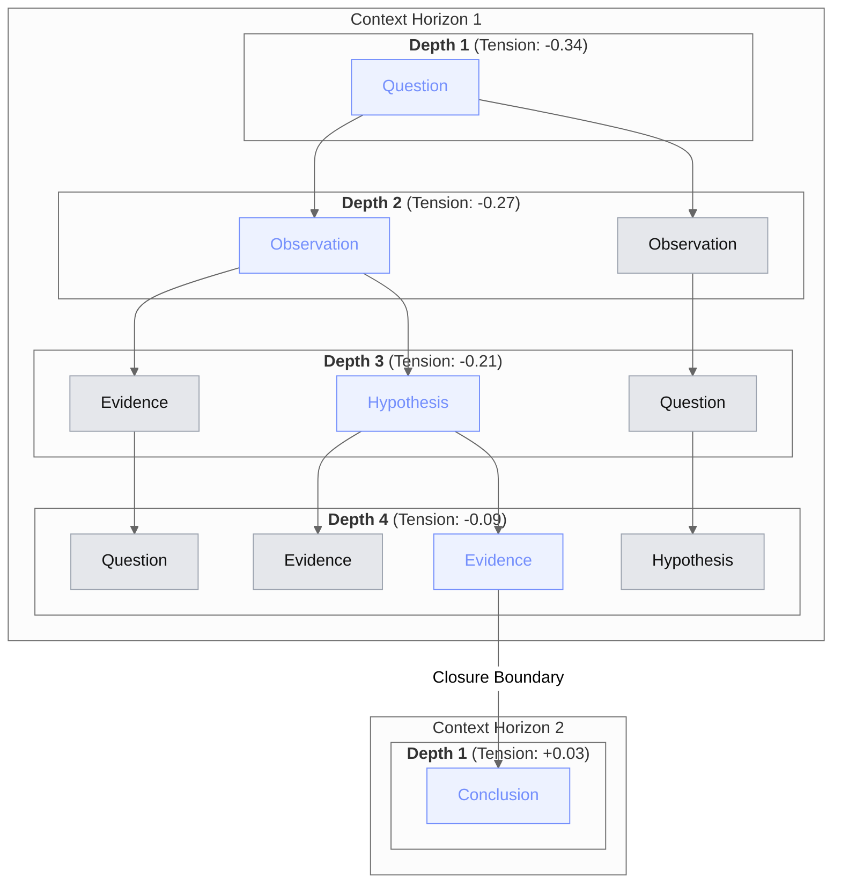
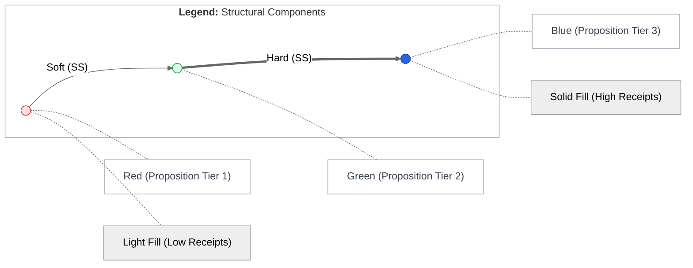
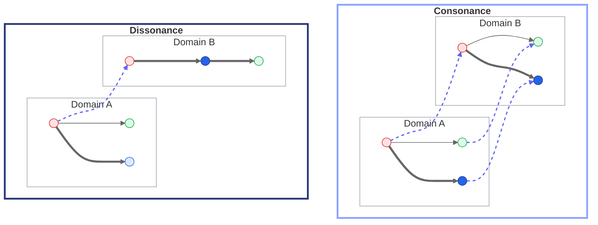
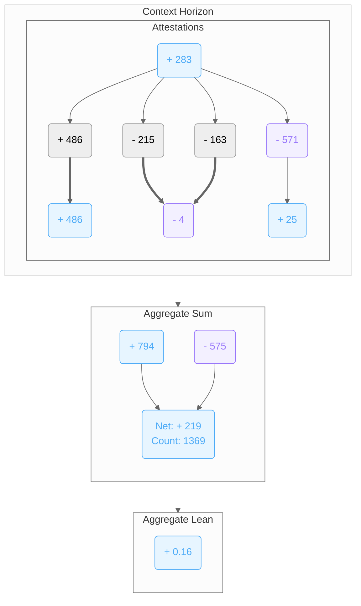
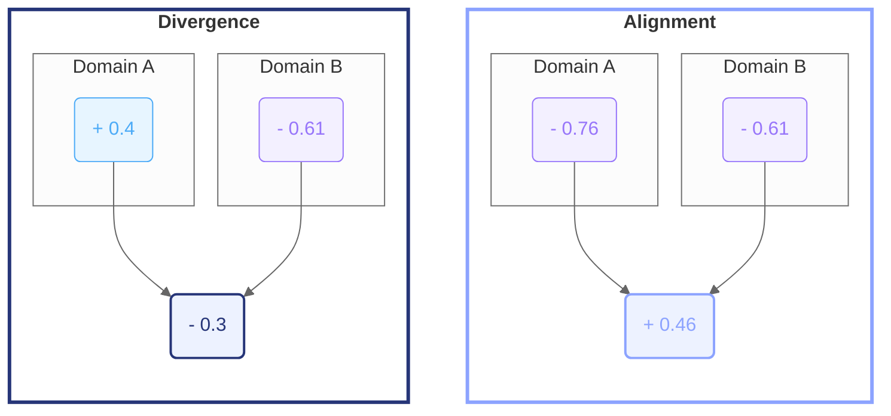
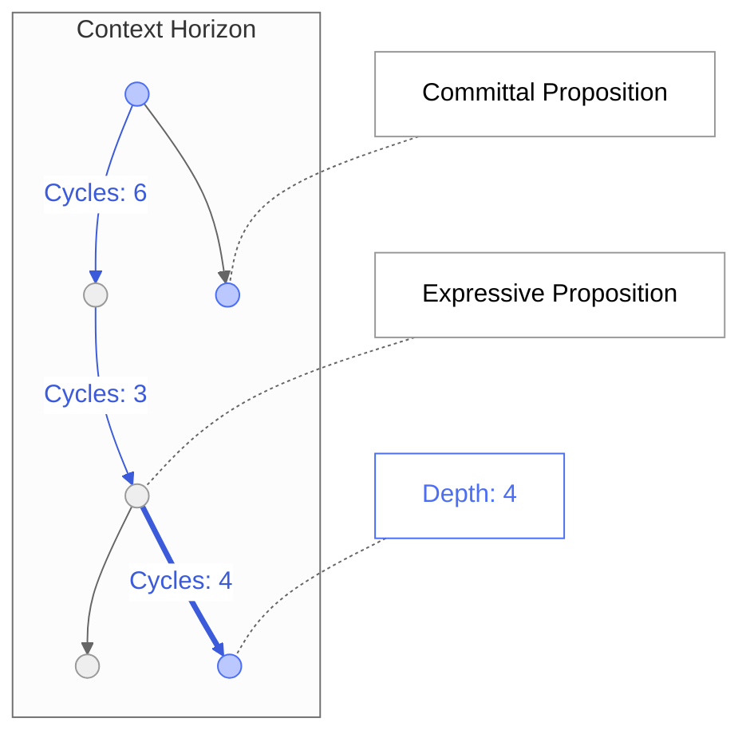
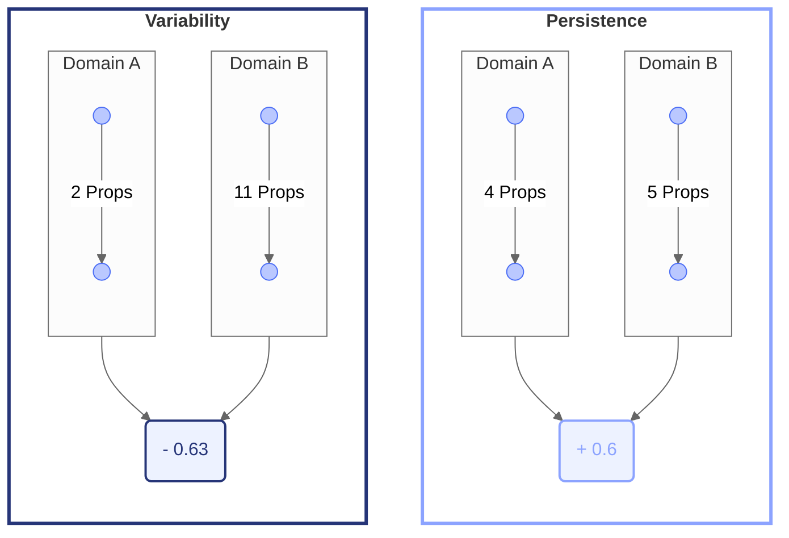
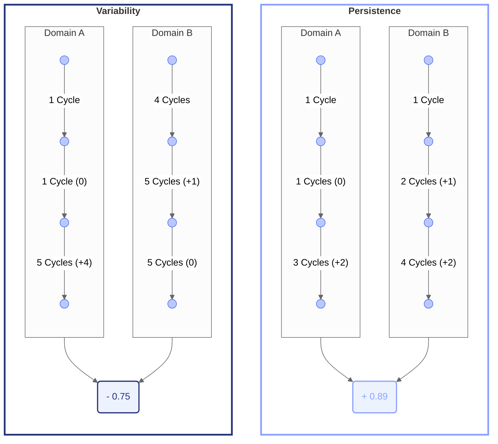

import { Center, rem, Grid, GridCol } from "@mantine/core";
import {
  IconHexagon,
  IconUserHexagon,
  IconScale,
  IconWhirl,
  IconCircle,
  IconBulb,
  IconBulbFilled,
  IconStack2Filled,
  IconTool,
  IconRotate2,
  IconRotateClockwise2,
  IconReceipt,
} from "@tabler/icons-react";
import ConceptFeatures from "../../components/Commons/ConceptFeatures/ConceptFeatures";
import ContextWindowBars from "../../components/Commons/ContextWindowBars/ContextWindowBars";
import ClassificationRegisters from "../../components/Commons/ClassificationRegisters/ClassificationRegisters";
import AttestationInput from "../../components/Commons/AttestationInput/AttestationInput";
import PropositionCard from "../../components/Commons/PropositionCard/PropositionCard";
import ContextWindowExample from "../../components/Commons/ContextWindowExample/ContextWindowExample";

# Overview

## What this is

**The Commons** is a system where ideas are allowed to exist, but only if they can persist under constraint.

Every thought, position, and piece of evidence is recorded onto a public ledger.
Nothing exists without lineage. If something appears, it has a trace. If it persists, it has support.

Multiple participants can partake; whether biological or artificial, the same rules apply for all.

### Work in Progress

I'm currently implementing The Commons in code and writing the documentation as I go.
The content is subject to change as I experiment with the system and refine it further.

## The Concept

- [Charge](/commons#charge) is provided by the system, as a shared and conserved resource.
- [Participants](/commons#participant) can allocate or reclaim Charge by contributing:
  - [Propositions](/commons#proposition) - e.g. Thoughts, ideas, questions, hypotheses, claims.
  - [Attestations](/commons#attestation) - A directional stance; Supporting or Refuting Propositions.
  - [Supersessions](/commons#supersession) - Propositions supercede one another through various branching types;
    Revise, Reclassify, Variant, Reconcile, and Commit.
  - [Receipts](/commons#receipt) - Confirmation and verifiable metadata from utilising
    system-defined [Instruments](/commons#instruments).

<ConceptFeatures />

- Propositions are recorded into [Classification Registers](/commons#classification-registers),
  which represent structured containers of context.
- Participant's navigate through [Cycles & Phases](/commons#cycles-and-phases),
  determining which Classification Registers can be read, superceded from, and written to.
- [Observables](/commons#observables) are computed properties calculated by comparing unique aspects
  of the inputs between two complementary [Domains](/commons#domain);
  - Registerial-Supersessional shape & structure -> [Correspondence](/commons#correspondence)
  - Attestational direction & magnitude -> [Chirality](/commons#chirality)
  - Committal depth & cadence -> [Closure](/commons#closure)
- [Tension](/commons#tension) becomes a dynamic system output, computed by symmetrically balancing the Observables.
- Whether a contribution allocates or reclaims Charge depends on how it affects Tension.

Multiple Participants from a variety of sources is desired. Whether synthetic or human,
each may provide a unique [Perspective](/commons#perspective) over the changing context space,

```mermaid
---
config:
  flowchart:
    curve: basis
  theme: neutral
---
flowchart TB
    PARTICIPANT(Participant)

    subgraph SUBSTRATE["Relational Substrate"]
        direction TB

        CYC(Cycles)
        A(Attestations)
        R(Receipts)
        P(Propositions)
        SS(Supersessions)

        P --> SS
        SS -.-> P
        CYC --> P
        CYC --> R
        R -.-> P
        R -.-> A
        CYC --> A
        A --> P
    end

    PARTICIPANT -->|"Input"| CYC

    subgraph OBS["Observable System"]
        direction TB

        subgraph MEAS["Measurements"]
            direction LR
            C(Correspondence)
            H(Chirality)
            L(Closure)
        end

        subgraph DERIVED["Derived"]
            direction TB

            subgraph PROJ["Projection"]
                direction LR
                TU(Turbulence)
                PR(Prominence)
            end

            subgraph FIELD["Field"]
                direction LR
                T(Tension)
            end
        end

        C ==>|"(-)"| TU
        C ==>|"(+)"| PR

        H ==>|"(-)"| TU
        H ==>|"(+)"| PR

        L ==>|"(-)"| TU
        L ==>|"(+)"| PR

        TU ==> T
        PR ==> T
    end

    SS ==> C
    A ==> H
    P ==> L
    CYC ==> L

    subgraph REGISTERS["Classification Registers"]
        direction TB

        TR("↑ Tension <small>(Potential Charge)</small>")

        subgraph DOMAIN["Active Domain"]
            direction LR

            subgraph EMERGENCE["Emergence"]
                direction TB

                PROMINENT(↑ Prominence)
                ACTIVITY(Activity):::activityRegister
                FRONTIER(Frontier):::frontierRegister
                CANON(Canon):::canonRegister
            end

            subgraph SETTLEMENT["Settlement"]
                direction TB

                TURBULENT(↑ Turbulence)
                SIGNAL(Signal):::signalRegister
                STANCE(Stance):::stanceRegister
                CONCORD(Concord):::concordRegister
            end
        end
    end

    T -.-> REGISTERS

    TR -.->|"T<small>dir</small> < 0"| SETTLEMENT
    TR -.->|"T<small>dir</small> > 0"| EMERGENCE

    PROMINENT -.->|"P1"| ACTIVITY
    ACTIVITY -.->|"P2, P5"| FRONTIER
    FRONTIER -.->|"P3, P6"| CANON
    CANON -.->|"P4"| ACTIVITY
    CANON -.->|"P7"| PROMINENT

    TURBULENT -.->|"P1"| SIGNAL
    SIGNAL -.->|"P2, P5"| STANCE
    STANCE -.->|"P3, P6"| CONCORD
    CONCORD -.->|"P4"| SIGNAL
    CONCORD -.->|"P7"| TURBULENT

    CH(Context Horizon)
    PERS(Perspective)

    CH ---> PERS
    PERS -.->|"← Tension"| CH

    PARTICIPANT_OUT(Participant)

    REGISTERS --> CH

    PERS -->|"Output"| PARTICIPANT_OUT

    classDef activityRegister fill:#fee2e2,stroke:#dc2626,color:#7f1d1d,stroke-width:2px
    classDef frontierRegister fill:#dcfce7,stroke:#16a34a,color:#14532d,stroke-width:2px
    classDef canonRegister fill:#dbeafe,stroke:#2563eb,color:#1e3a8a,stroke-width:2px

    classDef signalRegister fill:#fef9c3,stroke:#ca8a04,color:#713f12,stroke-width:2px
    classDef stanceRegister fill:#fae8ff,stroke:#c026d3,color:#701a75,stroke-width:2px
    classDef concordRegister fill:#cffafe,stroke:#0891b2,color:#164e63,stroke-width:2px

    classDef pcRegister fill:#dbe4ff,stroke:#3b5bdb,color:#3b5bdb,stroke-width:2px
    classDef turbulenceRegister fill:#dbe4ff,stroke:#263578,color:#263578,stroke-width:2px
    classDef prominenceRegister fill:#edf2ff,stroke:#8ca3ff,color:#8ca3ff,stroke-width:2px

    class ACTIVITY activityRegister
    class FRONTIER frontierRegister
    class CANON canonRegister

    class SIGNAL signalRegister
    class STANCE stanceRegister
    class CONCORD concordRegister

    class TR pcRegister
    class TURBULENT turbulenceRegister
    class PROMINENT prominenceRegister

    %% Negative (-) edges
    linkStyle 9,11,13,15 stroke:#3b5bdb,color:#3b5bdb

    %% Positive (+) edges
    linkStyle 10,12,14,16 stroke:#748ffc,color:#748ffc
```

enhancing overall [sensemaking](<https://en.wikipedia.org/wiki/Sensemaking_(information_science)>).

---

# Motivation

I started developing The Commons to demonstrate two complex ideas:

1. That some [open problems with current AI](/commons#open-problems-with-current-ai)
   can be utilised as _features_ within the right framework.
2. To provide a concrete working implementation of the [Miranova Matrix](/matrix),
   and observe any emergent ideas that may follow.

## Open Problems with Current AI

There are well documented limitations with modern [Large Language Models (LLMs)](https://en.wikipedia.org/wiki/Large_language_model),
and many revolve around context.

### Context Size

LLM providers are releasing newer models with larger [Maximum Context Windows (MCWs)](https://en.wikipedia.org/wiki/Context_window),
documented as more capable while requiring more energy and resources.

However, the following research paper by [Norman Paulsen](https://www.linkedin.com/in/norman-paulsen/)
highlights that while the MCW is ever increasing, empirical data reveals there is a Maximum _Effective_
Context Window (MECW) regarding problem accuracy, that varys between models.

[Context Is What You Need: The Maximum Effective Context Window for Real World Limits of LLMs](https://arxiv.org/abs/2509.21361)

Not only does a model's MECW appear _tiny_ compared to its MCW, some older models can
outperform newer models depending on the problem type.

### Context Compaction and Drift

Once context size grows larger than a model's MCW, then performance of the model typically
degrades with an increased risk of [hallucination](<https://en.wikipedia.org/wiki/Hallucination_(artificial_intelligence)>).
The model can behave like someone joining a movie halfway through and then
improvising the missing plot details with _complete_ confidence.

Systems generally approach this problem through the process of compaction;
reducing the active context back down to a size that fits within the model's MCW.

To gain a broader insight into the various methods of compaction,
I highly recommend this article written by [William Waites](https://www.linkedin.com/in/wwaites/),
as he eloquently describes some modern approaches.

[Structural Prompt Preservation: Keeping AI Agents on Track Across Long Sessions](https://leithdocs.com/ldc/documents/outgoing/structural-prompt-preservation.md)

The main problem with compaction is that context drifts over time. The effect
compounds as the active context increases in size and is continuously altered.
It doesn't feel so dissimilar to how humans drift in conversation topic.

Once the underlying project or context space grows large enough,
the challenge becomes more about how the context is structurally managed and accessed,
rather than through any static instructions alone.

---

# Novelty

With the main goal in mind of conserving energy and resources, can we build a system
that aims to use the _least_ amount of tokens for any given model? How can we
identify an effective window of context, regardless of the Participant?

## Commons Context: Depth

Rather than thinking in terms of size or raw token count,
The Commons provides a solution using **Context Depth**:
How deep is the longest chain of Propositions, to the nearest stable Closure boundary?

- The nearest stable Closure boundary is labelled the [Context Horizon](/commons#context-horizon),
  where new commitment shifts Tension direction into the opposite Domain.
- A Participant's [Perspective](/commons#perspective) determines how many Context Horizons are readable,
  which is calculated by comparing how their individual contributions affect Tension.
- Compaction occurs as a side-effect; when a Participant's contributions increase Tension then
  their Perspective is decreased, reducing the amount of context that is readable.
- Perspective may fluctuate over a changing context space, representing a dynamic
  MECW that mirrors the Participant's contributions.
- Drift is exploited as a desired feature; with stabilisation constraints in place,
  drift then functions as a form of [hormesis](https://en.wikipedia.org/wiki/Hormesis) for ideas.
- Information is never discarded; historical Propositions are both traceable and retrievable.

The structure forms a [Directed Acyclic Graph (DAG)](https://en.wikipedia.org/wiki/Directed_acyclic_graph),
where Propositions are the nodes, and Supersessions are the edges. Much like [Git](https://en.wikipedia.org/wiki/Git)
version control, but with unique constraints based around Participant Phases,
Classification Registers, Attestations, and Receipts.

---

# Observable System

No new features need to be considered, as various properties can be derived from the inputs.

It's important to note that the following implementations are not intended to be final
or set in stone. They have simply been chosen to demonstrate a working proof of concept.
The implementation details are intentionally left open for experimentation and may change
over time.

## Measurements

Each of the following three measurements captures a distinct property of the substrate.
None is computed using another measurement's value, though all three draw from the same
changing structure. A single contribution may influence more than one measurement simultaneously.

#### Homeostasis

I've borrowed the term [homeostasis](https://en.wikipedia.org/wiki/Homeostasis)
from biology, as each measurement creates a feedback loop that pulls
the system back towards equilibrium, rather than letting it drift.
The homeostatic effects of each measurement are described below.

### 1. Correspondence

How similar in **shape and structure** is one Domain to the other,
and how strongly is that structure anchored?

Take the structural components of the relational substrate graph;
Propositions, Supersessions (SS), Classification Registers, and Receipts,
and then categorise them into groups of **nodes** and **edges**:

#### Node Labels

To compare Propositions across the two Domains structurally, while disregarding the content itself,
the pairings of Classification Registers are reduced down to a single label for each tier.
Represented as Red, Green, and Blue (RGB) nodes for an easier visual interpretation.

- **R** - Activity & Signal (Tier 1)
- **G** - Frontier & Stance (Tier 2)
- **B** - Canon & Concord (Tier 3)

The three tiers identifed represent each register position in terms of node hierarchy and possible edge transitions.
Ultimately, the names and colours used do not matter.

#### Edge Labels

The five Supersessional types can be reduced down to either a **soft** or **hard** edge between Propositions,
whether branching from an existing Proposition or replacing one.

- **S** - Branching, Soft Supersession (Thin Edge)
- **H** - Reconciling, Hard Supersession (**Thick Edge**)

#### Node Weighting

One Receipt per Participant (1PP) counts as an additional weighting extension,
reinforcing how strongly the structure is anchored.

- **(-)** Light Colour (None/Low Receipts)
- **(+)** **Solid Colour** (Many/High Receipts)

#### Graph Kernel

Using the Context Horizon as the graph region for comparison,
a Correspondence value is calculated across Domains using a weighted
[Weisfeiler-Leman (WL)](https://en.wikipedia.org/wiki/Weisfeiler_Leman_graph_isomorphism_test)
graph kernel to differentiate the following poles:

- **Consonance (1)** - Structural similarity
- **Dissonance (-1)** - Structural differentiation

#### Homeostatic Effect

Correspondence plays a balancing role during the **Read** Stage of Phase 5: **Mediate**.

- The only Propositions available to be Read during this Phase are the ones that align
  with the current Correspondence direction; either Consonant or Dissonant Propositions.
- This provides an indirect balancing effect that feeds into the next Stage; as the dominant
  structures are selected (whether Consonant or Dissonant), subsequent contributions
  will more likely affect the dominant Correspondence value.

---

### 2. Chirality

How similar is the **direction and magnitude** of Attestations between Domains,
and how strongly are they endorsed with Receipts?

Take the active head nodes within a Context Horizon, i.e. the nodes that haven't yet
been hard superceded, and then identify the aggregate lean.

After obtaining the product between Domains, we get **Chirality**:

- **Alignment (1)** - Leaning the same direction
- **Divergence (-1)** - Leaning the opposite direction

It is important to note that Alignment & Divergence are not the same as Support & Refute.
Alignment between Domains means that they _lean together_, even if that lean is toward
a Refuting direction. Divergence is where the Domains lean apart in opposing directions.

#### Reinforcement

Receipts attached to Attestations (1PP) count as an additional
weighting extension, reinforcing the chosen direction.

To provide additional weight without taking away from the value of an
Attestation itself, a ratio of `3:1` Attestations to Receipts is used.
This is intended to be a starting point for experimentation while being configurable.

#### Rationale

A rationale is optional and doesn't count directly towards reinforcement the
same way Receipts do, however the rationale may still sway another Participant's opinion
depending on how they decide to attest themselves.

#### Homeostatic Effect

Chirality plays a balancing role during the **Gate** Stage of Phase 6: **Bias**:

- The only Propositions available to be Superceded (Gated) from are the ones that
  align with the aggregate lean direction of the current Context Horizon.
- As reconciled Propositions are no longer active, they no longer contribute
  towards Chirality, therefore trending the aggregate lean towards balance.

---

### 3. Closure

How similar in **depth and cadence** are Propositions written between Domains,
and how strongly is depth reinforced?

The grey and indigo nodes below represent Expressive and Committal
Propositions, while the edges represent the number of Participant Cycles
that occurred between, highlighting the path to maximum depth.

#### Depth

Depth is based on the number of Propositions that form the longest chain.
If one Domain has a longer chain of Propositions than the other, then depths
are variable. If the chain length is similar, then depths are persistent.

$$
Depth =
1 -
2\left(
\frac{\left|D_A - D_B\right|}
{\max(D_A, D_B)}
\right)
$$

- **Persistence (1)** - Similar depths
- **Variability (-1)** - Varying depths

##### Reinforcement

Receipts (1PP) count as additional weighting extension to reinforce Depth.

The same weighting method as Chirality is used as a default option,
with a ratio of `3:1` Depth to Receipts. This weighting is intended to be
configurable and may change over time through experimentation.

#### Cadence

Rather than using an external measurement of time, Cadence is measured in number
of Participant Cycles.
This allows the frequency of contributions to be made relative to participation,
regardless of how much real world time passes between.

Taking the number of Cycles between each Proposition, the
[Coefficient of Variation (CV)](https://en.wikipedia.org/wiki/Coefficient_of_variation)
measures how regularly they occur relative to each Domain's average interval.
This allows for temporal dispersion to be compared between each Participant,
even when they contribute at very different frequencies.

$$
Cadence =
1 -
2\left(
\frac{\left|CV_A - CV_B\right|}
{\max(CV_A, CV_B)}
\right)
$$

- **Persistence (1)** - Intervals are similar
- **Variability (-1)** - Intervals vary considerably

#### Closure

The average between Depth and Cadence represents the final Closure value. This
is a convenient first option, but exact implementation details may change with time.

$$
Closure =
\frac{Depth + Cadence}
2
$$

#### Homeostatic Effect

Closure plays a balancing role during the **Write** Stage of Phase 7: **Order**:

- This is the final Phase where Expressive Propositions get written as Committal.
- Both Depth and Cadence must align the same direction for commitment to occur,
  forming a hysteretic gate when they diverge to prevent frequent switching.
- Expressive Propositions only affect local Charge, while Committal Propositions
  affect global Charge.
- The balancing effect for Closure naturally falls out from the cost of writing;
  commitment that causes high Tension allocates global Charge, while Tension reducing
  commitment reclaims global Charge.

## Projections

The positives and negatives from each measurement get combined to form two polar projections.

```mermaid
---
config:
  flowchart:
    curve: basis
  theme: neutral
---
flowchart LR

  subgraph TUR[<strong>Turbulence</strong>]
    direction TD

    D(Dissonance)
    G(Divergence)
    V(Variability)

  end

  subgraph PRO[<strong>Prominence</strong>]
    direction TD

    C(Consonance)
    A(Alignment)
    S(Persistence)
  end

  D <-.->|Correspondence| C
  G <-.->|Chirality| A
  V <-.->|Closure| S

  classDef promNode fill:#edf2ff,stroke:#8ca3ff,color:#8ca3ff,stroke-width:2px
  classDef turbNode fill:#edf2ff,stroke:#263578,color:#263578,stroke-width:2px

  class D,G,V turbNode
  class C,A,S promNode

  style PRO fill:transparent,stroke:#8ca3ff,stroke-width:3px
  style TUR fill:transparent,stroke:#263578,stroke-width:3px

```

If a stable and balanced substrate is represented somewhere in the middle,
then each projection represents a shift away from stability. Neither takes
precedence over the other, they are each complementary ways of representing imbalance.

### Prominence

Prominence represents a rigid and over-ordered structure,
with high dominance pressure favouring an Attestational direction.
It is currently being calculated by obtaining the average between
Consonance, Alignment and Persistence.

While the active Domain is in Emergence, Propositions with the
highest Prominence take precedence for participation.

### Turbulence

Turbulence represents a chaotic or unresolved structure with
strong Attestational conflict. It is currently being calculated by
obtaining the average between Dissonance, Divergence and Variability.

While the active Domain is in Settlement, Propositions with the
highest Turbulence take precedence for participation.

### Tension

Tension represents the imbalance between the two projections,
simply the difference between Prominence and Turbulence.

Magnitudal form:

$$
\mathrm{Tension}_{m} = \left| \mathrm{Prominence} - \mathrm{Turbulence} \right|
$$

Directional form:

$$
\mathrm{Tension}_{d} = \mathrm{Prominence} - \mathrm{Turbulence}
$$

- **T ≈ 0** → balanced structural field.
- **T > 0** → over-prominent, rigid, over-ordered, dominance pressure.
- **T < 0** → over-turbulent, chaotic, unstable, unresolved fragmentation.

### Hysteresis

The above Measurements, Projections and Tension shift direction
with [hysteresis](https://en.wikipedia.org/wiki/Hysteresis).

Directional state is a requirement to satisfy the constraints, and so when each of
the above observables reaches a value of zero (neither positive or negative),
the previous direction remains active until the value changes to the opposite direction.

However on a fresh substrate, no historical direction yet exists.
One would assume a sensible default might be positive (+) for these
values, however a unique combination is required to satisfy the constraints.

These default directions must be considered:

- Tension **(+)**
  - Correspondence **(+)**
  - Chirality **(+)**
  - Closure **(-)**
    - Depth **(-)**
    - Cadence **(-)**

The default direction for Closure must be negative (-), as Depth & Cadence directions
form the admissibility gate for commitment, which gets explained below in the bootstrapping
process.

Tension's sign is defaulted positive (+), as the average of (+, +, -) from
Correspondence, Chirality, and Closure respectively.

## Bootstrapping

The bootstrapping process demonstrates how a substrate is created, while simultaneously
providing it with Charge.

We simply follow the constraints:

- Before any Proposition exists, an empty substrate is perfectly
  balanced with a Tension of `0`.
- The active Domain is Emergence, due to the initial positive (+) Tension direction.
- The initial Proposition must be Committal, as Expressive Propositions
  can only exist as variants from existing Propositions.
- Committal Propositions can only get written into Canon & Concord
  registers, therefore the first written register is Canon.
- The initial Committal Proposition is labelled the [Origin](/commons#origin).
- Both an Attestation and Receipt are preconditions for commitment,
  so they must also be provided along with the Origin.
- The default hysteretic gate for Depth & Cadence allows for a variable commit.
- The Origin then gets written into Canon:
  - Becoming the entry point for the initial Context Horizon.
  - As nothing exists in Settlement to compare to, 100% Turbulence is produced.
  - Tension's sign flips negative (-).
  - The current Context Horizon is then closed off in Emergence,
    and the active Domain switches to Settlement.
- The system is now in a state of maximum Tension, i.e. reclaimable Charge.

## Charge

_This section is incomplete._

Charge is a shared and conserved resource. It's simply what remains without Tension.

$$
Charge = 1 - \left|Tension\right|
$$

### Local & Global Charge

_This section is incomplete._

Global Charge is the shared pool which gets consumed by Committal Propositions,
while local Charge is only affected by the Expressive Propositions underneath.

Once an Expressive Proposition becomes Committal, then the expressive
Charge gets realised and affects global Charge.

## Closure Horizon

_This section is incomplete._

## Classification Registers

_This section is incomplete._

<ClassificationRegisters />

---

## Model

### Participant

_This section is incomplete._

<IconUserHexagon size={64} />

A Participant is an input source that drives The Commons.
Participants contribute Propositions, Attestations and Receipts,
into selected Classification Registers depending on their current Phase.

A Participant consists of:

- **Callsign**: A human-readable identifier, for easier differentiation.
- **Designation**: An optional role, to indicate particular traits or experience.

#### Cycles and Phases

_This section is incomplete._

Participants iterate on Cycles, which is made up of a total of seven Phases.

A Participant's age is determined by the number of Cycles performed

---

### Proposition

_This section is incomplete._

<IconBulb size={64} />

A Proposition represents a single unit of expression.

It could be a statement;

<PropositionCard proposition="Matter and energy might be expressions of underlying structure." />

an open question,

<PropositionCard proposition="What if dark matter is not unseen mass, but an unobserved mode of structure?" />

or a claim,

<PropositionCard proposition="Matter does not carry information, it is the manifestation of it." />

A Proposition is not valid or invalid by default.
Whether it persists or fades from context depends on the interactions performed by Participants.

#### Tiers

A Proposition can exist in one of two **Tiers**:

<Grid my="lg">
  <GridCol span={6}>
    <PropositionCard
      proposition={{
        tier: "committal",
        title: "Committal",
        statement: "Requires an Attestation and Receipt. Affects global Charge.",
      }}
    />
  </GridCol>

  <GridCol span={6}>
    <PropositionCard
      proposition={{
        tier: "expressive",
        title: "Expressive",
        statement: "No Receipt or Attestation required. Only affects local Charge.",
      }}
    />
  </GridCol>
</Grid>

- Committal Propositions require both an Attestation and Receipt to exist.
- Expressive Propositions can only become variants from existing Propositions.

---

### Attestation

_This section is incomplete._

<IconWhirl size={64} />

An Attestation is a _directional_ participation applied to a Proposition:

- **Support**: The Participant agrees with the Proposition.
- **Refute**: The Participant disagrees with the Proposition.

It's not your typical like or dislike button. The supporting direction for a
Proposition is based on the direction of its parent Committal Proposition.
Another way of looking at it; do you spin _with_ the current direction
or do you pull against it?

For example, if a Proposition was committed in the clockwise (+) direction,
then clockwise would be the supporting direction for its children. To disagree would be to
attest in the anti-clockwise (-) direction. Once a Proposition gets committed in the opposite
direction to its Committal parent, then the supporting and refuting directions switch.

Rules for attesting:

- A Participant can only apply one active Attestation per Proposition.
- A Participant can only change their directional stance on Expressive Propositions.
- Attestations can only be applied to Propositions in the writeable Classification Register of the Participant's Phase.
- Participants can optionally increase the weight of their Attestation by attaching Receipts.
- A Rationale only provides value by potentially swaying other Participant's opinions.

These rules allow an Attestation to hold significance, while reducing spam behaviour.

<small>Attestations are an implementation of Chirality.</small>

---

### Receipt

When a Participant utilises an Instrument, the system will provide a Receipt.

Participants can then read Receipts to retrieve further context.

- Contains metadata specific to the Instrument used (file storage location, URL, dataset, hash, etc.).
- Can be attached to both Propositions and Attestations.
- Acts as reinforcement for existing structure.
- No committal proposition can exist without a Receipt.

For a proof of concept, the following receipt types are defined:

- **Citation**: A reference to another Proposition or Attestation.
- **Artefact**: A file that lives in a configurable Data Storage location.
- **Hyperlink**: A URL, title and summary for a page on the world wide web.

Receipt types can be extended as the system evolves and further utility is desired.

### Instruments

_This section is incomplete._

- **Cite**: Obtain a reference to another Proposition or Attestation

---

# Acknowledgements

- Authored by Claire Mira Shaw. Proudly written in my own words, without the assistance of AI.
- This document is still a working draft and will be subject to change.
- The implementations provided are working examples, and are intended to be
  configurable upon creation of a substrate.
