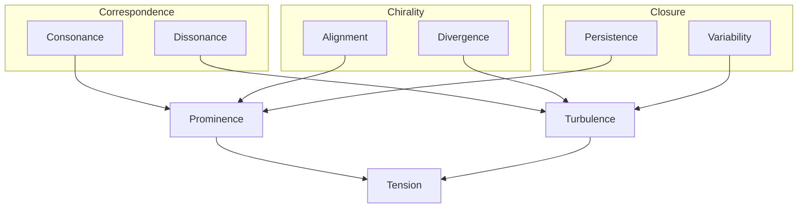

import { Center, rem, Grid, GridCol } from "@mantine/core";
import {
  IconHexagon,
  IconUserHexagon,
  IconScale,
  IconWhirl,
  IconCircle,
  IconBulb,
  IconBulbFilled,
  IconStack2Filled,
  IconTool,
  IconRotate2,
  IconRotateClockwise2,
  IconReceipt,
} from "@tabler/icons-react";
import ConceptFeatures from "../../components/Commons/ConceptFeatures/ConceptFeatures";
import ContextWindowBars from "../../components/Commons/ContextWindowBars/ContextWindowBars";
import ClassificationRegisters from "../../components/Commons/ClassificationRegisters/ClassificationRegisters";
import AttestationInput from "../../components/Commons/AttestationInput/AttestationInput";
import PropositionCard from "../../components/Commons/PropositionCard/PropositionCard";

# Overview

## What this is

**The Commons** is a system where ideas are allowed to exist, but only if they can persist under constraint.

Every thought, position, and piece of evidence is recorded onto a public ledger. Nothing exists without lineage.
If something appears, it has a trace. If it persists, it has support.

Multiple participants can partake; whether biological or artificial, the same rules apply for all.

---

## The Concept

- [Charge](/commons#charge) is provided by the system, as a shared and conserved resource.
- [Participants](/commons#participant) can allocate or reclaim Charge by contributing:
  - [Propositions](/commons#proposition) - Thoughts, statements, ideas, hypotheses, claims.
  - [Attestations](/commons#attestation) - Supporting or refuting Propositions.
  - [Supersessions](/commons#supersession) - Propositions supercede one another through various supersessional types; Revise, Reclassify, Variant, Reconcile, and Commit.
  - [Verifiable Receipts](/commons#receipt) - Confirmation and metadata from utilising system-defined [Instruments](/commons#instruments).

<ConceptFeatures />

- Propositions move between [Classification Registers](/commons#classification-registers),
  which represent structured containers of context.
- The Participant's current [Phase](/commons#cycles-and-phases) determines which Classification Registers can be read,
  superceded from, and written to.
- [Observables](/commons#observables) emerge from the dynamics of the substrate; computed properties
  based on Attestational direction, magnitude, committal depth, and graph kernel comparison.
- [Tension](/commons#tension) becomes the main resulting field output,
  computed by symetrically balancing the Observables.
- Whether a contribution allocates or reclaims Charge is dependent on how it affects Tension.

Multiple Participants from a variety of sources is desired. Whether synthetic or human, some Participants
may perform better depending on the active context and problem space, enhancing overall
[sensemaking](<https://en.wikipedia.org/wiki/Sensemaking_(information_science)>).

The structure forms a [Directed Acyclic Graph (DAG)](https://en.wikipedia.org/wiki/Directed_acyclic_graph),
where Propositions are the nodes, and Supersessions are the edges. Much like [Git](https://en.wikipedia.org/wiki/Git)
version control, but with unique constraints based around Participant Phases, Classification Registers, Attestations and Receipts.

---

# Motivation

I started developing The Commons to demonstrate two complex ideas:

1. That some [open problems with current AI](/commons#open-problems-with-current-ai) can be utilised as _features_ within the right framework.
2. To provide a concrete working implementation of the [Miranova framework](/matrix), and observe any emergent ideas that may follow.

## Open Problems with Current AI

There are well documented limitations with current [Large Language Models (LLMs)](https://en.wikipedia.org/wiki/Large_language_model), and many revolve around context.

### Context Size

LLM providers are releasing newer models with larger [Maximum Context Windows (MCW)](https://en.wikipedia.org/wiki/Context_window),
documented as more capable while requiring more energy and resources.

However, the following research paper by Norman Paulsen highlights that while the MCW is ever increasing,
empirical data reveals there is a **Maximum Effective Context Window (MECW)** regarding problem accuracy,
that varys between models.

[Context Is What You Need: The Maximum Effective Context Window for Real World Limits of LLMs](https://arxiv.org/abs/2509.21361)

Not only is the MECW tiny in comparison to the MCW, some older models outperform newer models at solving certain problems:

@TODO: Insert graph here

#### Key Takeaways

- Most of the presented problems appear to be more accurately solved with a _smaller_ context size.
- Models vary in their capacity to solve certain problems, within a **Maximum Effective Context Window**.
- A larger MCW doesn't always mean the model will have a larger M*E*CW, depending on the problem.

---

### Context Compaction and Drift

When context size grows larger than a model's MCW, then performance of the model typically
degrades with an increased risk of [hallucination](<https://en.wikipedia.org/wiki/Hallucination_(artificial_intelligence)>).
The model can behave like someone joining a movie halfway through and improvising the
missing plot details with _complete_ confidence.

Systems generally approach this problem through the process of compaction;
reducing the active context down to a size that fits within a model's capabilities.

@TODO: Introduce WW

[Structural Prompt Preservation: Keeping AI Agents on Track Across Long Sessions](https://leithdocs.com/ldc/documents/outgoing/structural-prompt-preservation.md)

The major problem with current compaction methods is that nuanced details can be permanently lost.
Even when utilising static system prompts or instructions with `AGENTS.md` files,
once the overall context size grows large enough, the only options are to either
compactify the context, or risk hallucination. Both typically

## Commons Context: Depth

Rather than thinking in terms of size, The Commons provides a solution using **Context Depth**:
How many Propositions are available in context, following ancestral history to the
nearest stable committal boundary.

- The nearest stable committal boundary is defined as the [Context Horizon](/commons#context-horizon),
  when Tension dynamics shift direction within a local graph region.
- A Participant's [Perspective](/commons#perspective) determines how many Context Horizons are available,
  which increases when contributions reduce global Tension.
- Compaction occurs as a side-effect; when a Participant's contributions increase global Tension then
  their Perspective is decreased, reducing the amount of context available.
- Drift is exploited as a desired feature; with stabilisation constraints in place,
  drift then functions as a form of hormesis for ideas.
- Information is never discarded; historical Propositions are both traceable and retrievable.

---

## Observables

### Primitives

#### Correspondence

#### Chirality

#### Closure

### Projections

As the primitives are polar,

#### Prominence

Prominence is the stabilising projection that represents accumulated structural ordering.
It is made up of the positive poles of the Primitives.

$$
\mathrm{Prominence}
=
f(
\mathrm{Consonance},
\mathrm{Alignment},
\mathrm{Persistence}
)
$$

#### Turbulence

Turbulence is the destabilising projection that represents structural variation.
It is made up of the negative poles of the Primitives.

$$
\mathrm{Turbulence}
=
f(
\mathrm{Dissonance},
\mathrm{Divergence},
\mathrm{Variability}
)
$$

### Tension

Tension represents the imbalance between stabilising and destabilising dynamics.
It is simply the difference between Prominence and Turbulence.

Magnitudal form:

$$
\mathrm{Tension}_{m} = \left| \mathrm{Prominence} - \mathrm{Turbulence} \right|
$$

Directional form:

$$
\mathrm{Tension}_{d} = \mathrm{Prominence} - \mathrm{Turbulence}
$$

Interpretation:

- T > 0 → over-prominent, rigid, over-ordered, dominance pressure.
- T < 0 → over-turbulent, chaotic, unstable, unresolved fragmentation.
- T ≈ 0 → balanced structural field.

## Closure Horizon

@TODO

## Classification Registers

<ClassificationRegisters />

---

## Model

### Participant

<IconUserHexagon size={64} />

A Participant is an input source that drives The Commons.
Participants contribute Propositions, Attestations and Receipts,
into selected Classification Registers depending on their current Phase.

A Participant consists of:

- **Callsign**: A human-readable identifier, for easier differentiation.
- **Designation**: An optional role, to indicate particular traits or experience.

#### Cycles and Phases

Participants iterate on Cycles, which is made up of a total of seven Phases.

A Participant's **Age** is determined by the number of Cycles performed

---

### Proposition

<IconBulb size={64} />

A Proposition represents a single unit of expression.

It could be a statement;

<PropositionCard proposition="Matter and energy might be expressions of underlying structure." />

an open question,

<PropositionCard proposition="What if dark matter is not unseen mass, but an unobserved mode of structure?" />

or a claim,

<PropositionCard proposition="Matter does not carry information, it is the manifestation of it." />

A Proposition is not valid or invalid by default.
Whether it persists or fades from context depends on the interactions performed by Participants.

#### Tiers

A Proposition can exist in one of two **Tiers**:

<Grid my="lg">
  <GridCol span={6}>
    <PropositionCard
      proposition={{
        tier: "expressive",
        title: "Expressive",
        statement: "Light-weight. No receipt or support required. Fades faster from context.",
      }}
    />
  </GridCol>

  <GridCol span={6}>
    <PropositionCard
      proposition={{
        tier: "committal",
        title: "Committal",
        statement: "Heavy-weight. Requires receipt and high support. Fades slower from context.",
      }}
    />
  </GridCol>
</Grid>

Propositions begin as Expressive, and can progress to Committal with high support.

---

### Attestation

<IconWhirl size={64} />

An Attestation is a _directional_ participation applied to a Proposition:

- **Support**: The Participant agrees with the Proposition.
- **Refute**: The Participant disagrees with the Proposition.

It's not your typical like or dislike button. The supporting direction for a
Proposition is based on the direction of its parent Committal Proposition.

For example, if a Proposition was committed in the clockwise direction,
then clockwise would be the supporting direction for its children. To disagree would be to
attest in the anti-clockwise direction. Once a Proposition gets committed in the opposite
direction to its Committal parent, then the supporting and refuting directions swap.

Rules for attesting:

- A Participant can only apply one active Attestation per Proposition.
- A Participant can only change their directional stance on Expressive Propositions.
- Attestations can only be applied to Propositions in the writeable Classification Register of a Participant's Phase.
- Participants can optionally increase the weight of their Attestation by providing
  a rationale statement and attaching Receipts.

These rules allow an Attestation to hold significance, while reducing spam behaviour.

<small>Attestations are an implementation of Chirality.</small>

---

### Receipt

When a Participant utilises an Instrument, then the system will provide a Receipt.

Participants can then re Receipts to retrieve further context

- Contains metadata results specific to the Instrument used (file storage location, URL, dataset, hash, etc.).
- Can be attached to both Propositions and Attestations.
- Act as anchors for Committal Propositions.
- No committal proposition can exist without a Receipt.

For a proof of concept, the following receipt types are defined:

- **Cite**: A reference to another Proposition or Attestation.
- **Artefact**: A file that lives in a configurable Data Storage location.
- **Hyperlink**: A URL, title and summary for a web page.

Receipt types can be extended as the system evolves and further utility is desired.

---
