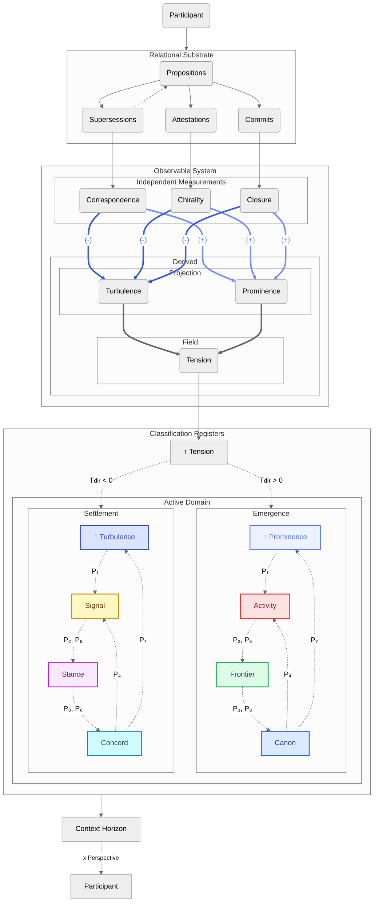
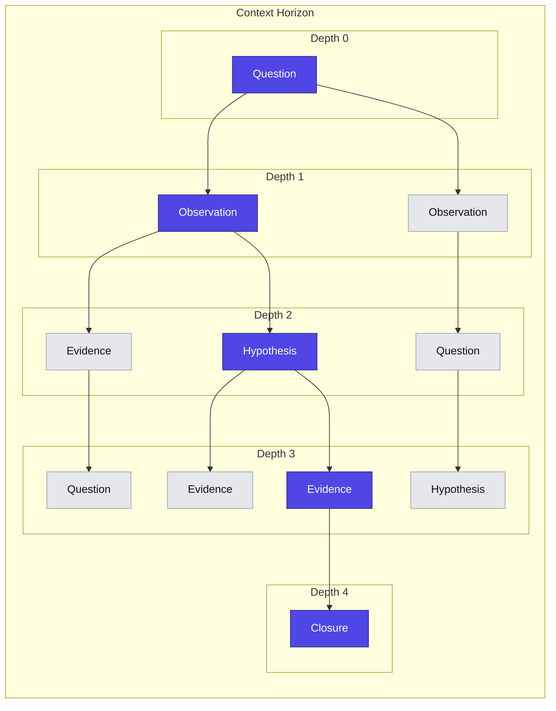
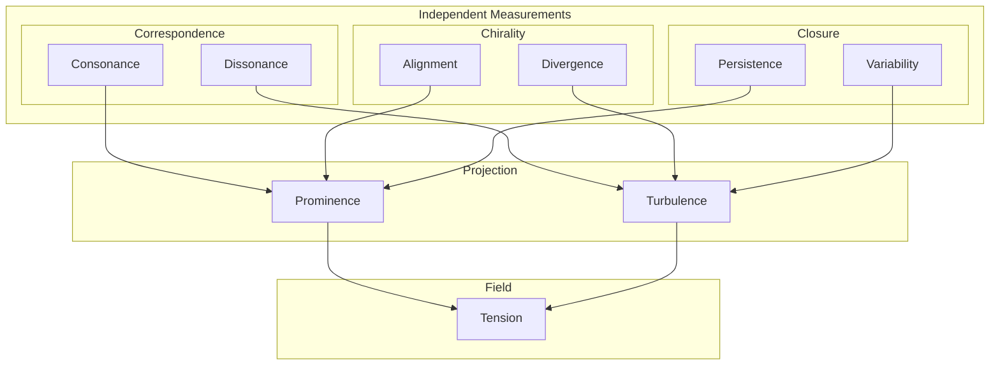
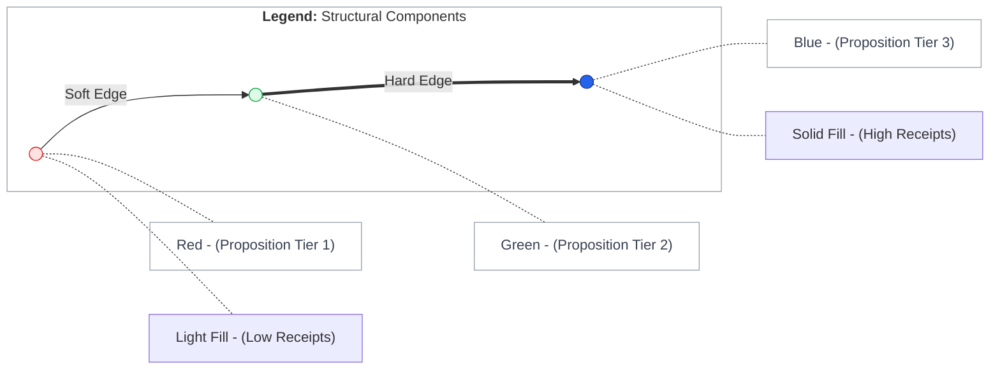
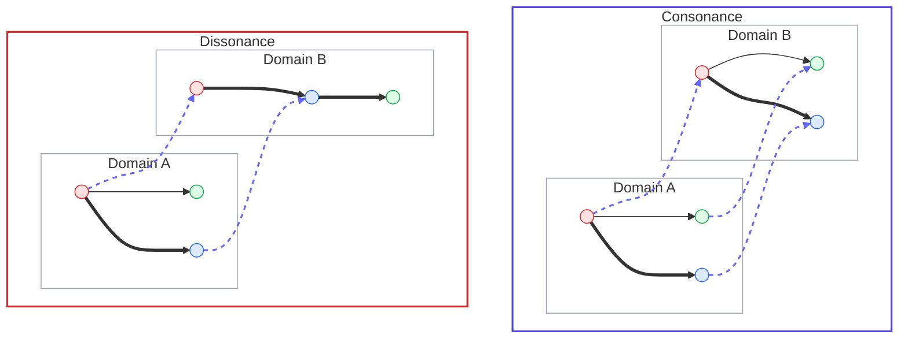
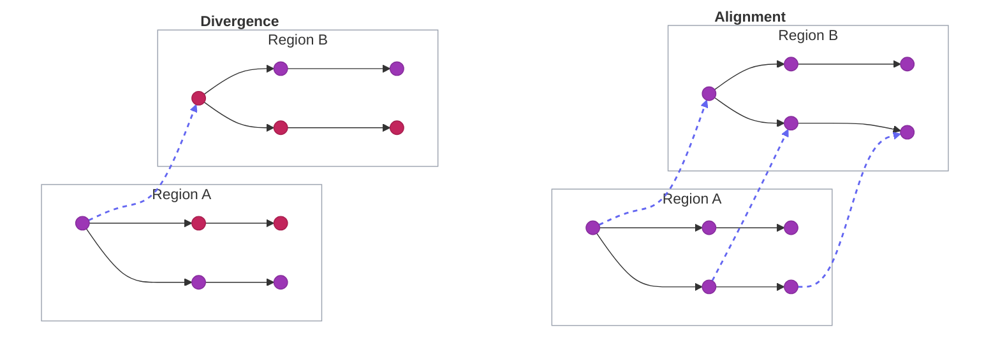
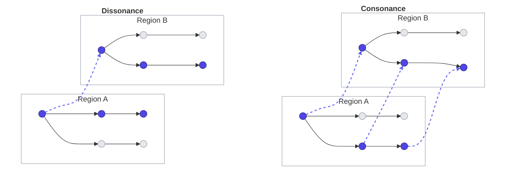

import { Center, rem, Grid, GridCol } from "@mantine/core";
import {
  IconHexagon,
  IconUserHexagon,
  IconScale,
  IconWhirl,
  IconCircle,
  IconBulb,
  IconBulbFilled,
  IconStack2Filled,
  IconTool,
  IconRotate2,
  IconRotateClockwise2,
  IconReceipt,
} from "@tabler/icons-react";
import ConceptFeatures from "../../components/Commons/ConceptFeatures/ConceptFeatures";
import ContextWindowBars from "../../components/Commons/ContextWindowBars/ContextWindowBars";
import ClassificationRegisters from "../../components/Commons/ClassificationRegisters/ClassificationRegisters";
import AttestationInput from "../../components/Commons/AttestationInput/AttestationInput";
import PropositionCard from "../../components/Commons/PropositionCard/PropositionCard";
import ContextWindowExample from "../../components/Commons/ContextWindowExample/ContextWindowExample";

# Overview

## What this is

**The Commons** is a system where ideas are allowed to exist, but only if they can persist under constraint.

Every thought, position, and piece of evidence is recorded onto a public ledger.
Nothing exists without lineage. If something appears, it has a trace. If it persists, it has support.

Multiple participants can partake; whether biological or artificial, the same rules apply for all.

---

## The Concept

- [Charge](/commons#charge) is provided by the system, as a shared and conserved resource.
- [Participants](/commons#participant) can allocate or reclaim Charge by contributing:
  - [Propositions](/commons#proposition) - Thoughts, ideas, questions, hypotheses, claims.
  - [Attestations](/commons#attestation) - A directional stance, by Supporting or Refuting Propositions.
  - [Supersessions](/commons#supersession) - Propositions supercede one another through various branching types;
    Revise, Reclassify, Variant, Reconcile, and Commit.
  - [Receipts](/commons#receipt) - Confirmation and verifiable metadata from utilising
    system-defined [Instruments](/commons#instruments).

<ConceptFeatures />

- Propositions are recorded into [Classification Registers](/commons#classification-registers),
  which represent structured containers of context.
- Participant's navigate through [Cycles & Phases](/commons#cycles-and-phases),
  determining which Classification Registers can be read, superceded from, and written to.
- [Observables](/commons#observables) are computed properties based from comparing unique aspects
  of the inputs between two complementary [Domains](/commons#domain);
  - Propositional & Supersessional shape -> [Correspondence](/commons#correspondence)
  - Attestational direction & magnitude -> [Chirality](/commons#chirality)
  - Committal depth & frequency -> [Closure](/commons#closure)
- [Tension](/commons#tension) becomes a dynamic system output, computed by symmetrically balancing the Observables.
- Whether a contribution allocates or reclaims Charge depends on how it affects Tension.

Multiple Participants from a variety of sources is desired. Whether synthetic or human,
each may provide a unique [Perspective](/commons#perspective) over the changing context space,
enhancing overall [sensemaking](<https://en.wikipedia.org/wiki/Sensemaking_(information_science)>).

The structure forms a [Directed Acyclic Graph (DAG)](https://en.wikipedia.org/wiki/Directed_acyclic_graph),
where Propositions are the nodes, and Supersessions are the edges. Much like [Git](https://en.wikipedia.org/wiki/Git)
version control, but with unique constraints based around Participant Phases, Classification Registers, Attestations and Receipts.

# Motivation

I started developing The Commons to demonstrate two complex ideas:

1. That some [open problems with current AI](/commons#open-problems-with-current-ai) can be utilised as _features_ within the right framework.
2. To provide a concrete working implementation of the [Miranova Matrix](/matrix), and observe any emergent ideas that may follow.

## Open Problems with Current AI

There are well documented limitations with modern [Large Language Models (LLMs)](https://en.wikipedia.org/wiki/Large_language_model),
and many revolve around context.

### Context Size

LLM providers are releasing newer models with larger [Maximum Context Windows (MCW)](https://en.wikipedia.org/wiki/Context_window),
documented as more capable while requiring more energy and resources.

However, the following research paper by [Norman Paulsen](https://www.linkedin.com/in/norman-paulsen/)
highlights that while the MCW is ever increasing, empirical data reveals there is a Maximum _Effective_
Context Window (MECW) regarding problem accuracy, that varys between models.

[Context Is What You Need: The Maximum Effective Context Window for Real World Limits of LLMs](https://arxiv.org/abs/2509.21361)

Not only is a model's MECW tiny in comparison to its MCW, some older models can outperform newer models at solving certain problems:

---

### Context Compaction and Drift

Once context size grows larger than a model's MCW, then performance of the model typically
degrades with an increased risk of [hallucination](<https://en.wikipedia.org/wiki/Hallucination_(artificial_intelligence)>).
The model can behave like someone joining a movie halfway through and improvising the
missing plot details with _complete_ confidence.

Systems generally approach this problem through the process of compaction;
reducing the active context back down to a size that fits within the model's MCW.

To gain a broader insight into the various methods of compaction,
I highly recommend this article written by [William Waites](https://www.linkedin.com/in/wwaites/),
as he eloquently describes some modern solutions:

[Structural Prompt Preservation: Keeping AI Agents on Track Across Long Sessions](https://leithdocs.com/ldc/documents/outgoing/structural-prompt-preservation.md)

The main problem with compaction is that context drifts over time.
Not only that, the effect compounds as the active context is continuously altered.
It doesn't feel so so dissimilar to how humans drift in conversation topic.

Once the underlying project or context space grows large enough, the challenge becomes more about
how the context is structurally managed and accessed, rather than any static instructions alone.

## Commons Context: Depth

Rather than thinking in terms of size or raw token count, The Commons provides a solution using **Context Depth**:
How deep is the longest chain of Committal Propositions, to the nearest stable Closure boundary.

- The nearest stable Closure boundary is labelled as the [Context Horizon](/commons#context-horizon),
  where new commitment shifts Tension direction into the opposite Domain.
- A Participant's [Perspective](/commons#perspective) determines how many Context Horizons are readable,
  which is calculated by comparing how their individual contributions affect Tension.
- Compaction occurs as a side-effect; when a Participant's contributions increase Tension then
  their Perspective is decreased, reducing the amount of context available.
- Perspective may oscillate over a changing substrate, providing a dynamic
  MECW that mirrors the Participant's contributions.
- Drift is exploited as a desired feature; with stabilisation constraints in place,
  drift then functions as a form of [hormesis](https://en.wikipedia.org/wiki/Hormesis) for ideas.
- Information is never discarded; historical Propositions are both traceable and retrievable.

---

# Documentation

## Observables

### Measurements

No new features need to be considered. As contributions are written to the ledger, various properties can be derived.

The **Independent Measurements** are simply three unique ways of measuring the same substrate.

#### Correspondence

How similar in structure or shape is one graph region to another,
and how strongly is that structure anchored?

Take the structural components of the relational substrate graph;
Propositions, Supersessions, Classification Registers, and Receipts,
and then categorise them into groups of **nodes** and **edges**:

**Node Labels**

To compare Propositions across the two Domains *structurally*, while disregarding the content itself,
the pairings of Classification Registers are reduced down to a single label for each tier.
Represented as Red, Green, and Blue (RGB) nodes for an easier visual interpretation.

- **R** - Activity & Signal
- **G** - Frontier & Stance
- **B** - Canon & Concord

**Edge Labels**

The five Supersession types can be reduced down to either a **soft** or **hard** edge between Propositions,
whether branching from an existing Proposition or replacing one.

- **S** - Soft Supersession (Thin Line)
- **H** - Hard Supersession (Thick Line)

**Node Weighting**

One Receipt per Participant counts as an additional weighting extension,
representing how strongly the structure is anchored by grounding Participation.

- **(-)** Light Colour (None/Low Receipts)
- **(+)** Solid Colour - (Many/High Receipts)

The label names or colours ultimately do not matter, the three tiers
identifed represent each register position in terms of node hierarchy and possible edge transitions.
Receipts only play a role in reinforcing the existing structure.

**Graph Kernel**

Using the Context Horizon as the graph region for comparison,
a Correspondence value is computed across domains using a weighted
[Weisfeiler-Leman (WL)](https://en.wikipedia.org/wiki/Weisfeiler_Leman_graph_isomorphism_test)
graph kernel to differentiate the following poles:

- **Consonance** - Structural similarity
- **Dissonance** - Structural differentiation

#### Chirality

Do Attestation directions align or conflict within a graph region?

#### Closure

Committal Depth comparison between two graph regions; is the commitment frequency persistent or variable?

### Projections

The positives and negatives from each Primitive get combined to form two polar opposites:

#### Prominence

Prominence is the stabilising projection that represents accumulated
structural ordering, made up of the positive poles of the Primitives.

$$
\mathrm{Prominence}
=
f(
\mathrm{Consonance},
\mathrm{Alignment},
\mathrm{Persistence}
)
$$

#### Turbulence

Turbulence is the destabilising projection that represents
structural variation, made up of the negative poles of the Primitives.

$$
\mathrm{Turbulence}
=
f(
\mathrm{Dissonance},
\mathrm{Divergence},
\mathrm{Variability}
)
$$

### Tension

Tension represents the imbalance between stabilising and destabilising dynamics,
simply the difference between Prominence and Turbulence.

Magnitudal form:

$$
\mathrm{Tension}_{m} = \left| \mathrm{Prominence} - \mathrm{Turbulence} \right|
$$

Directional form:

$$
\mathrm{Tension}_{d} = \mathrm{Prominence} - \mathrm{Turbulence}
$$

Commons Interpretation:

- **T > 0** → over-prominent, rigid, over-ordered, dominance pressure.
- **T < 0** → over-turbulent, chaotic, unstable, unresolved fragmentation.
- **T ≈ 0** → balanced structural field.

## Closure Horizon

@TODO

## Classification Registers

<ClassificationRegisters />

---

## Model

### Participant

<IconUserHexagon size={64} />

A Participant is an input source that drives The Commons.
Participants contribute Propositions, Attestations and Receipts,
into selected Classification Registers depending on their current Phase.

A Participant consists of:

- **Callsign**: A human-readable identifier, for easier differentiation.
- **Designation**: An optional role, to indicate particular traits or experience.

#### Cycles and Phases

Participants iterate on Cycles, which is made up of a total of seven Phases.

A Participant's **Age** is determined by the number of Cycles performed

---

### Proposition

<IconBulb size={64} />

A Proposition represents a single unit of expression.

It could be a statement;

<PropositionCard proposition="Matter and energy might be expressions of underlying structure." />

an open question,

<PropositionCard proposition="What if dark matter is not unseen mass, but an unobserved mode of structure?" />

or a claim,

<PropositionCard proposition="Matter does not carry information, it is the manifestation of it." />

A Proposition is not valid or invalid by default.
Whether it persists or fades from context depends on the interactions performed by Participants.

#### Tiers

A Proposition can exist in one of two **Tiers**:

<Grid my="lg">
  <GridCol span={6}>
    <PropositionCard
      proposition={{
        tier: "expressive",
        title: "Expressive",
        statement: "Light-weight. No receipt or support required. Fades faster from context.",
      }}
    />
  </GridCol>

  <GridCol span={6}>
    <PropositionCard
      proposition={{
        tier: "committal",
        title: "Committal",
        statement: "Heavy-weight. Requires receipt and high support. Fades slower from context.",
      }}
    />
  </GridCol>
</Grid>

Propositions begin as Expressive, and can progress to Committal with high support.

---

### Attestation

<IconWhirl size={64} />

An Attestation is a _directional_ participation applied to a Proposition:

- **Support**: The Participant agrees with the Proposition.
- **Refute**: The Participant disagrees with the Proposition.

It's not your typical like or dislike button. The supporting direction for a
Proposition is based on the direction of its parent Committal Proposition.

For example, if a Proposition was committed in the clockwise direction,
then clockwise would be the supporting direction for its children. To disagree would be to
attest in the anti-clockwise direction. Once a Proposition gets committed in the opposite
direction to its Committal parent, then the supporting and refuting directions switch.

Rules for attesting:

- A Participant can only apply one active Attestation per Proposition.
- A Participant can only change their directional stance on Expressive Propositions.
- Attestations can only be applied to Propositions in the writeable Classification Register of the Participant's Phase.
- Participants can optionally increase the weight of their Attestation by providing
  a rationale statement and attaching Receipts.

These rules allow an Attestation to hold significance, while reducing spam behaviour.

<small>Attestations are an implementation of Chirality.</small>

---

### Receipt

When a Participant utilises an Instrument, then the system will provide a Receipt.

Participants can then re Receipts to retrieve further context

- Contains metadata results specific to the Instrument used (file storage location, URL, dataset, hash, etc.).
- Can be attached to both Propositions and Attestations.
- Act as anchors for Committal Propositions.
- No committal proposition can exist without a Receipt.

For a proof of concept, the following receipt types are defined:

- **Cite**: A reference to another Proposition or Attestation.
- **Artefact**: A file that lives in a configurable Data Storage location.
- **Hyperlink**: A URL, title and summary for a web page.

Receipt types can be extended as the system evolves and further utility is desired.

---

# Acknowledgements

Authored by Claire Mira Shaw. Proudly written in my own words, without the assistance of AI.
